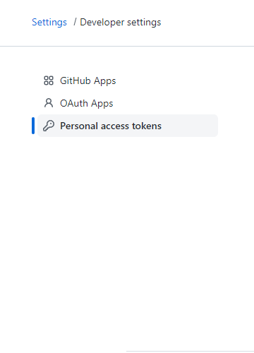

## REPO TO ACCESS THE AUTHORIZATION
---

## Step 1: Create the new token for github
&nbsp;&nbsp;&nbsp;&nbsp;Go to this link: [Get token](https://github.com/settings/tokens)
> :memo: **Note:** Your token can access 1 time so keep it on clipboard

---

## Step 2: Replace the token u need to code
&nbsp;&nbsp;&nbsp;&nbsp;Replace your `oauth_token = "xxx"` by your <mark>token take from Step 1 </mark>

---

## Step 3: Try the function with your github account
**1. Get method**  
    &nbsp;&nbsp;&nbsp;&nbsp; `get_repo(self)`  
    &nbsp;&nbsp;&nbsp;&nbsp; `get_user_info(self)`  
    &nbsp;&nbsp;&nbsp;&nbsp; `get_repo_info(self, repo_name)`  
    &nbsp;&nbsp;&nbsp;&nbsp; `get_last_repo_commit(self, name_repo)`  
    &nbsp;&nbsp;&nbsp;&nbsp; `get_content_new_file_on_repo(self, name_repo, name_file)`  
    &nbsp;&nbsp;&nbsp;&nbsp; `get_details_file_repo(self, name_repo, name_file)`  

**2. Post method**  
    &nbsp;&nbsp;&nbsp;&nbsp; `create_new_repo(self, name_repo, private = False)`  

**3. Put method**  
    &nbsp;&nbsp;&nbsp;&nbsp; `create_new_file_repo(self, name_repo, name_file, data ,message_repo = "create new file")`  
    &nbsp;&nbsp;&nbsp;&nbsp; `update_file_on_repo(self, name_repo, name_file, data ,message_repo = "Update new file")`  

**4. Delete method**  
    &nbsp;&nbsp;&nbsp;&nbsp; `delete_file_on_repo(self, name_repo, name_file, message_repo = "Delete new file")`  

---

## Step 4: Enjoy your code :coffee:

